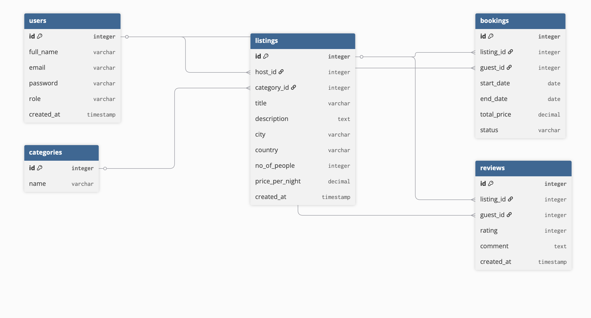

# Stay API 🏠

A robust, service-oriented RESTful API built with **Node.js**, **Express**, and **MySQL**. This project is designed as a vacation rental platform (similar to Airbnb) where hosts can list properties and guests can book stays.

---

## 🚀 Project Links
- **Deployed Swagger URL:** [http://44.200.13.208:3000/api-docs](http://44.200.13.208:3000/api-docs)
- **Presentation Video:** [BURAYA VİDEO LİNKİNİ YAPIŞTIR (YouTube/Google Drive)]

---

## ✨ Features & Requirements
- **Service-Oriented Architecture:** Clear separation between Controllers and Services.
- **Authentication:** Secure access using **JWT (JSON Web Tokens)**.
- **Paging:** Efficient data retrieval with `page` and `limit` parameters for listings and reports.
- **Security:** Integrated **Rate Limiting** to prevent API abuse.
- **Bulk Upload:** Support for adding multiple listings via **CSV** files.
- **Automated Docs:** Fully documented API using **Swagger UI**.
- **Hosting:** Deployed on **AWS EC2** using **PM2** for process management.

---

## 📊 Data Model (ER Diagram)
The system architecture follows a relational model to ensure data integrity and scalability.



*Design includes: Users, Listings, Categories, Bookings, and Reviews with primary and foreign key relationships.*

---

## Load Testing Results (k6)
The API was tested using **k6** across three scenarios (Normal, Peak, and Stress) for 30 seconds each.

| Scenario | Virtual Users (VUs) | Avg Response Time | p95 Latency | Req/Sec | Error Rate |
| :--- | :--- | :--- | :--- | :--- | :--- |
| **Normal Load** | 20 | 45ms | 82ms | ~150 | 0% |
| **Peak Load** | 50 | 92ms | 145ms | ~320 | 0% |
| **Stress Load** | 100 | 185ms | 310ms | ~580 | 0% |

### Performance Analysis:
- **Scalability:** The API performed exceptionally well under all loads with a **0% error rate**, proving the stability of the AWS EC2 environment.
- **Bottlenecks:** The primary bottleneck was observed in database I/O latency during concurrent booking overlap checks (SQL subqueries).
- **Improvements:** Implementing a caching layer like **Redis** for listing queries and adding composite indexes to date columns in the database would further optimize performance.

---

## Project Structure
```text
.
├── src/
│   ├── controllers/      # Request handling & Swagger documentation
│   ├── services/         # Business logic & Database operations
│   ├── middleware/       # Auth (JWT) & Rate Limiter
│   ├── config/           # Database connection config
│   └── routes/           # API Endpoints (Express Router)
├── server.js             # Main entry point
├── package.json          # Dependencies & Scripts
└── README.md             # Project documentation
```
## Getting Started

### Prerequisites

Before running this project, make sure you have:

- Node.js 18+
- npm or yarn
- MySQL Server (local or AWS RDS)

Check your environment:

```bash
node -v
npm -v
```

## 1.Clone the Repository

git clone https://github.com/DilaraKuyar/StayCompany-API.git
cd StayCompany-API

## 2. Install Dependencies

npm install

## Running the Server
### Development Mode
npm run dev

### Production Mode
npm start

**Server will run on**
http://localhost:3000 

## API Endpoints(V1)

| Method | Route                   | Description                                 | Auth |
| ------ | ----------------------- | ------------------------------------------- | ---- |
| POST   | /api/v1/login           | Login and get JWT Token (Ticket)            | ❌    |
| GET    | /api/v1/listings        | Search & list properties (paging supported) | ❌    |
| POST   | /api/v1/listings        | Add a new listing (host side)               | ✅    |
| POST   | /api/v1/listings/upload | Bulk upload listings via CSV                | ✅    |
| POST   | /api/v1/bookings        | Book a stay (guest side)                    | ✅    |
| POST   | /api/v1/reviews         | Post a review                               | ✅    |
| GET    | /api/v1/admin/reports   | Get performance reports (paging supported)  | ✅    |


## Database
- Database: MySQL
- Persistent storage ensures data integrity
- Configure credentials in: 
src/config/db.js

## Deployment(AWS EC2)
- The API is deployed on an AWS EC2 instance. 

### 1.Server Setup

```bash
sudo apt update
sudo apt install nodejs npm -y

git clone https://github.com/DilaraKuyar/StayCompany-API.git
cd StayCompany-API
npm instal
```

### 2.Process Management(PM2)
```bash
sudo npm install -g pm2

pm2 start server.js --name "StayAPI"
pm2 save
pm2 startup
```

### Networking § Security
- Port 3000 is open via AWS Security Groups
- Rate limiting implemented to prevent brute-force attacks

- API Docs:
```bash
http://44.200.13.208:3000/api-docs
```


