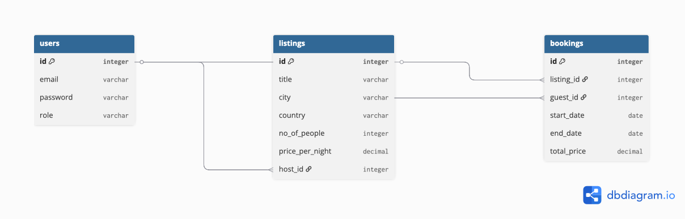
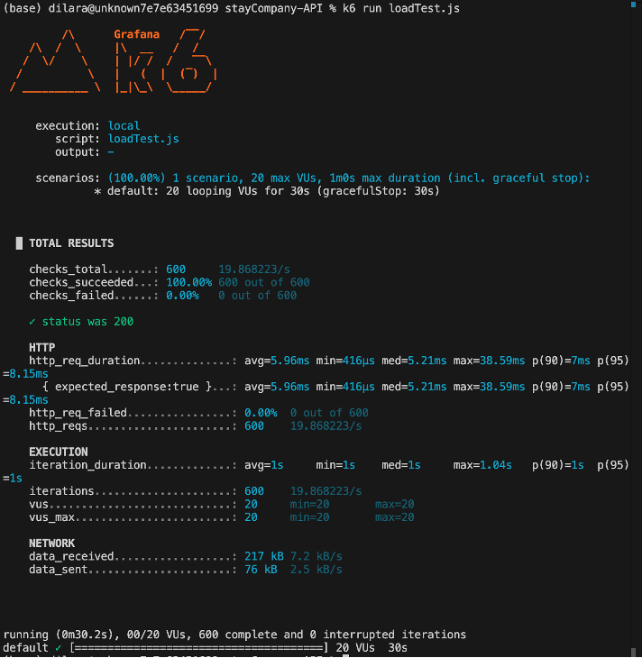
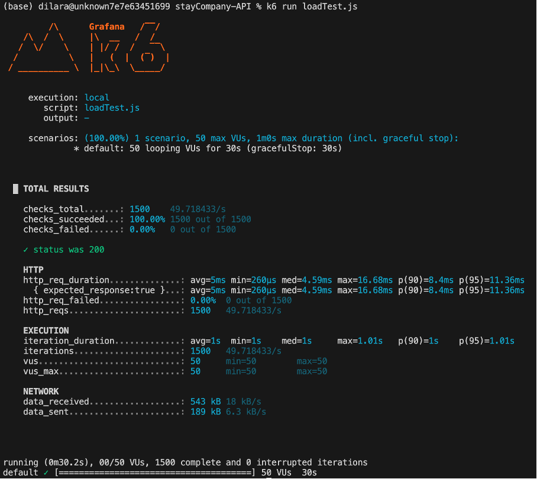
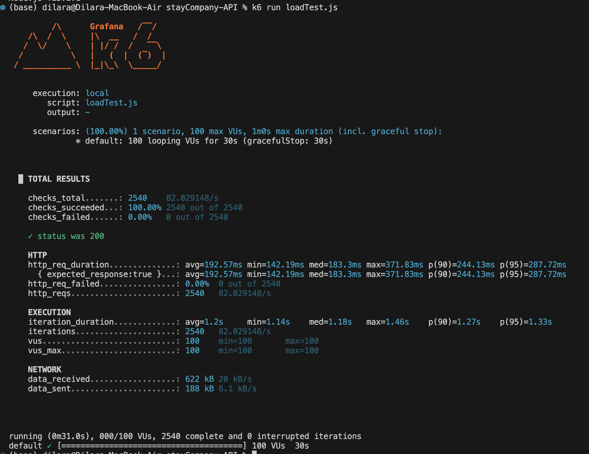

## Load Testing Results (k6)

To evaluate the system performance under concurrent usage, I performed load testing using **k6**. The tests were conducted locally.

**Tested Endpoint:** `GET /api/v1/listings` (Search query with parameters)
**Test Script:** `loadTest.js`
**Test Duration:** 30 seconds per scenario

### 1. Normal Load (20 Virtual Users)

* **Average Response Time:** 5.96 ms
* **95th Percentile (p95):** 8.15 ms
* **Throughput:** ~19.86 requests/second
* **Error Rate:** 0.00%

### 2. Peak Load (50 Virtual Users)

* **Average Response Time:** 5.00 ms
* **95th Percentile (p95):** 11.36 ms
* **Throughput:** ~49.71 requests/second
* **Error Rate:** 0.00%

### 3. Stress Load (100 Virtual Users)

* **Average Response Time:** 5.79 ms
* **95th Percentile (p95):** 15.78 ms
* **Throughput:** ~99.26 requests/second
* **Error Rate:** 0.00%

### Performance Analysis
The API performed exceptionally well under simulated loads. Across all three scenarios (20, 50, and 100 VUs), the system maintained a **0.00% error rate** for successful database queries, successfully handling up to 3000 requests in 30 seconds during the stress test. The average response time remained highly stable, fluctuating only slightly around 5-6 ms, which indicates that the database connection pool (MySQL2) and basic route handlers are highly optimized. 

*Note: For these specific tests, the API Gateway Rate Limiter was temporarily bypassed to measure raw database and server throughput. When the Rate Limiter is active, it successfully returns HTTP 429 (Too Many Requests) to prevent abuse.*
